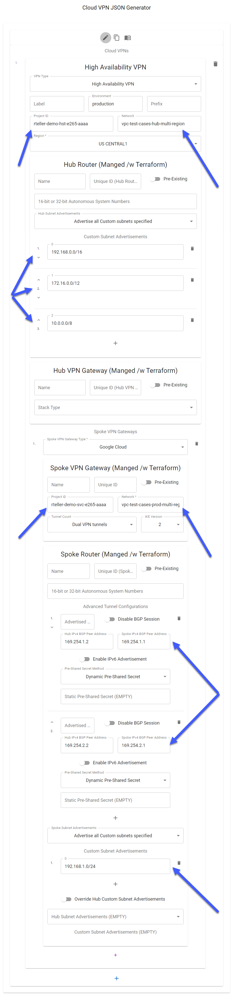
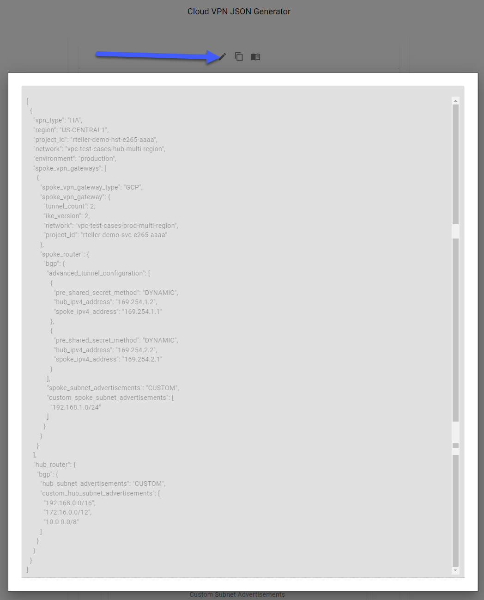
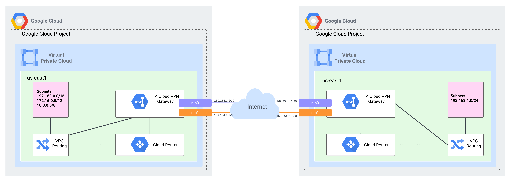
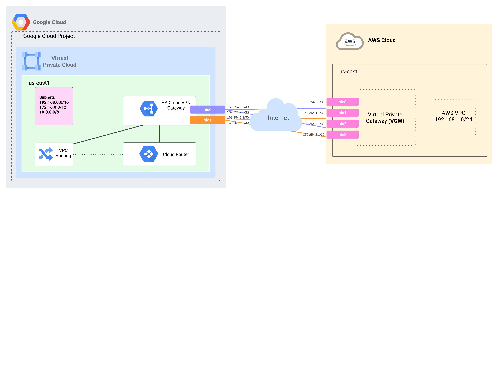

# Overview
This module was created to enable deployment of Cloud VPN resources quickly and at scale within GCP using a Hub and Spoke architecture.


## Example: GCP to GCP


<!-- <p align="center"> -->
<!-- <div style="display: flex; justify-content: center; align-items: flex-start;"> -->
<p align="center" style="display: flex; justify-content: center; align-items: flex-start;">
    
    
<!-- </div> -->
</p>
<p align="center">
    
</p>

## Example: GCP to AWS 
<p align="center">
    
</p>


  <!--  -->


# Resource Naming
## Resource Dynamic Name Generation
> Resource state Id's are dynamically generated based on attributes of the resource formatted using name-based uuids.
> - https://developer.hashicorp.com/terraform/language/functions/uuidv5

## Cloud Router (google_compute_router)
### Local Side
> Resource Naming == `format("cr-hub-vpn-%s",uuidv5("x500",<...>)`

| Name        | Primary Value                     | Secondary Value           | Default |
| ----------- | --------------------------------- | ------------------------- | :-----: |
| NAME        | (JSON) `.[].hub_router.name`      | N/A                       | `null`  |
| PREFIX      | (JSON) `.[].prefix`               | N/A                       | `null`  |
| ENVIRONMENT | (JSON) `.[].environment`          | N/A                       | `null`  |
| LABEL       | (JSON) `.[].label`                | N/A                       | `null`  |
| UNIQUE_ID   | (JSON) `.[].hub_router.unique_id` | N/A                       | `null`  |
| PROJECT_ID  | (JSON) `.[].project_id`           | (TF VAR) `var.project_id` |   N/A   |
| NETWORK     | (JSON) `.[].network`              | (TF VAR) `var.network`    |   N/A   |
| REGION      | (JSON) `.[].region`               | (TF VAR) `var.region`     |   N/A   |
| BGP_ASN     | (JSON) `.[].hub_router.bgp.asn`   | N/A                       | `null`  |

### Remote Side (If Managed by this module)
> Resource Naming == `format("cr-spoke-vpn-%s",uuidv5("x500",<...>)`

| Name        | Primary Value                     | Secondary Value           | Default |
| ----------- | --------------------------------- | ------------------------- | :-----: |
| NAME        | (JSON) `.[].hub_router.name`      | N/A                       | `null`  |
| PREFIX      | (JSON) `.[].prefix`               | N/A                       | `null`  |
| ENVIRONMENT | (JSON) `.[].environment`          | N/A                       | `null`  |
| LABEL       | (JSON) `.[].label`                | N/A                       | `null`  |
| UNIQUE_ID   | (JSON) `.[].hub_router.unique_id` | N/A                       | `null`  |
| PROJECT_ID  | (JSON) `.[].project_id`           | (TF VAR) `var.project_id` |   N/A   |
| NETWORK     | (JSON) `.[].network`              | (TF VAR) `var.network`    |   N/A   |
| REGION      | (JSON) `.[].region`               | (TF VAR) `var.region`     |   N/A   |
| BGP_ASN     | (JSON) `.[].hub_router.bgp.asn`   | N/A                       | `null`  |

## HA VPN Gateway (google_compute_ha_vpn_gateway)
### Local Side
> Resource Naming == `format("ha-hub-vpn-%s",uuidv5("x500",<...>)`

| Name        | Primary Value                           | Secondary Value           | Default |
| ----------- | --------------------------------------- | ------------------------- | :-----: |
| NAME        | (JSON) `.[].hub_vpn_gateway.name`       | N/A                       | `null`  |
| PREFIX      | (JSON) `.[].prefix`                     | N/A                       | `null`  |
| ENVIRONMENT | (JSON) `.[].environment`                | N/A                       | `null`  |
| LABEL       | (JSON) `.[].label`                      | N/A                       | `null`  |
| UNIQUE_ID   | (JSON) `.[].hub_vpn_gateway.unique_id`  | N/A                       | `null`  |
| PROJECT_ID  | (JSON) `.[].project_id`                 | (TF VAR) `var.project_id` |   N/A   |
| NETWORK     | (JSON) `.[].network`                    | (TF VAR) `var.network`    |   N/A   |
| REGION      | (JSON) `.[].region`                     | (TF VAR) `var.region`     |   N/A   |
| VPN_TYPE    | (JSON) `.[].vpn_type`                   | N/A                       |   N/A   |
| STACK_TYPE  | (JSON) `.[].hub_vpn_gateway.stack_type` | N/A                       |   N/A   |

### Remote Side (If Managed by this module)
> Resource Naming == `format("ha-spoke-vpn-%s",uuidv5("x500",<...>)`

| Name        | Primary Value                                                  | Secondary Value         | Tertiary Value            | Default |
| ----------- | -------------------------------------------------------------- | ----------------------- | ------------------------- | :-----: |
| NAME        | (JSON) `.[].spoke_vpn_gateways[].spoke_vpn_gateway.name`       | N/A                     | N/A                       | `null`  |
| PREFIX      | (JSON) `.[].prefix`                                            | N/A                     | N/A                       | `null`  |
| ENVIRONMENT | (JSON) `.[].environment`                                       | N/A                     | N/A                       | `null`  |
| LABEL       | (JSON) `.[].label`                                             | N/A                     | N/A                       | `null`  |
| UNIQUE_ID   | (JSON) `.[].spoke_vpn_gateways[].spoke_vpn_gateway.unique_id`  | N/A                     | N/A                       | `null`  |
| PROJECT_ID  | (JSON) `.[].spoke_vpn_gateways[].spoke_vpn_gateway.project_id` | (JSON) `.[].project_id` | (TF VAR) `var.project_id` |   N/A   |
| NETWORK     | (JSON) `.[].network`                                           | N/A                     | N/A                       |   N/A   |
| REGION      | (JSON) `.[].spoke_vpn_gateways[].spoke_vpn_gateway.region`     | (JSON) `.[].region`     | (TF VAR) `var.region`     |   N/A   |

## External VPN Gateway (google_compute_external_vpn_gateway)
> Resource Naming == `format("ha-peer-vpn-%s",uuidv5("x500",<...>)`

| Name            | Primary Value                                                      | Secondary Value           |     Default      |
| --------------- | ------------------------------------------------------------------ | ------------------------- | :--------------: |
| NAME            | (JSON) `.[].spoke_vpn_gateways[].spoke_vpn_gateway.name`           | N/A                       |      `null`      |
| PREFIX          | (JSON) `.[].prefix`                                                | N/A                       |      `null`      |
| ENVIRONMENT     | (JSON) `.[].environment`                                           | N/A                       |      `null`      |
| LABEL           | (JSON) `.[].label`                                                 | N/A                       |      `null`      |
| UNIQUE_ID       | (JSON) `.[].spoke_vpn_gateways[].spoke_vpn_gateway.unique_id`      | N/A                       |      `null`      |
| PROJECT_ID      | (JSON) `.[].project_id`                                            | (TF VAR) `var.project_id` |       N/A        |
| REDUNDANCY_TYPE | (JSON) `.[].spoke_vpn_gateways[].spoke_vpn_gateway.redudancy_type` | N/A                       | `TWO_INTERFACES` |

## VPN Tunnel | Router Interface | BGP Peer (google_compute_vpn_tunnel |google_compute_router_interface | google_compute_router_peer)
### Local Side
> Resource Naming == `format("vpn-%s-tunnel-%s",<...TUNNEL_TYPE...>,uuidv5("x500",<...>)`
> Tunnel Types
> - External == `hub-ext`
> - GCP == `hub-spoke`

| Name                         | Primary Value                                                  | Secondary Value           | Default |
| ---------------------------- | -------------------------------------------------------------- | ------------------------- | :-----: |
| NAME                         | `null`                                                         | N/A                       | `null`  |
| PREFIX                       | (JSON) `.[].prefix`                                            | N/A                       | `null`  |
| ENVIRONMENT                  | (JSON) `.[].environment`                                       | N/A                       | `null`  |
| LABEL                        | (JSON) `.[].label`                                             | N/A                       | `null`  |
| UNIQUE_ID                    | (JSON) `.[].hub_router.unique_id`                              | N/A                       | `null`  |
| PROJECT_ID                   | (JSON) `.[].project_id`                                        | (TF VAR) `var.project_id` |   N/A   |
| NETWORK                      | (JSON) `.[].network`                                           | (TF VAR) `var.network`    |   N/A   |
| REGION                       | (JSON) `.[].region`                                            | (TF VAR) `var.region`     |   N/A   |
| ROUTER_NAME                  | (JSON) `.[].hub_router.name`                                   | N/A                       | `null`  |
| HUB_VPN_GATEWAY_NAME         | (JSON) `.[].hub_vpn_gateway.name`                              | N/A                       | `null`  |
| HUB_VPN_GATEWAY_UNIQUE_ID    | (JSON) `.[].hub_vpn_gateway.unique_id`                         | N/A                       | `null`  |
| TUNNEL_INDEX                 | (TF VALUE DERIVED BASED ON Tunnel #)                           | N/A                       |   N/A   |
| SPOKE_VPN_GATEWAY_UUIDV5     | (TF VALUE DERIVED ABOVE)                                       | N/A                       |   N/A   |
| SPOKE_VPN_GATEWAY_TYPE       | (JSON) `.[].spoke_vpn_gateways[].spoke_vpn_gateway_type`       | N/A                       |   N/A   |
| SPOKE_VPN_GATEWAY_PROJECT_ID | (JSON) `.[].spoke_vpn_gateways[].spoke_vpn_gateway.project_id` | `.[].project_id`          |   N/A   |
| SPOKE_VPN_GATEWAY_NETWORK    | (JSON) `.[].spoke_vpn_gateways[].spoke_vpn_gateway.network`    | N/A                       |   N/A   |
| SPOKE_VPN_GATEWAY_NAME       | (JSON) `.[].spoke_vpn_gateways[].spoke_vpn_gateway.name`       | N/A                       | `null`  |
| SPOKE_VPN_GATEWAY_UNIQUE_ID  | (JSON) `.[].spoke_vpn_gateways[].spoke_vpn_gateway.unique_id`  | N/A                       | `null`  |

### Remote Side (If Managed by this module)
> Resource Naming == `format("vpn-r-l-tunnel-%s",uuidv5("x500",<...>)`

| Name                         | Primary Value                                                 | Secondary Value           | Default |
| ---------------------------- | ------------------------------------------------------------- | ------------------------- | :-----: |
| NAME                         | `null`                                                        | N/A                       | `null`  |
| PREFIX                       | (JSON) `.[].prefix`                                           | N/A                       | `null`  |
| ENVIRONMENT                  | (JSON) `.[].environment`                                      | N/A                       | `null`  |
| LABEL                        | (JSON) `.[].label`                                            | N/A                       | `null`  |
| UNIQUE_ID                    | (JSON) `.[].hub_router.unique_id`                             | N/A                       | `null`  |
| PROJECT_ID                   | (JSON) `.[].project_id`                                       | (TF VAR) `var.project_id` |   N/A   |
| NETWORK                      | (JSON) `.[].network`                                          | (TF VAR) `var.network`    |   N/A   |
| REGION                       | (JSON) `.[].region`                                           | (TF VAR) `var.region`     |   N/A   |
| ROUTER_NAME                  | (JSON) `.[].spoke_vpn_gateways[].spoke_router.name`           | N/A                       | `null`  |
| HUB_VPN_GATEWAY_NAME         | (JSON) `.[].spoke_vpn_gateways[].spoke_vpn_gateway.name`      | N/A                       | `null`  |
| HUB_VPN_GATEWAY_UNIQUE_ID    | (JSON) `.[].spoke_vpn_gateways[].spoke_vpn_gateway.unique_id` | N/A                       | `null`  |
| TUNNEL_INDEX                 | (TF VALUE DERIVED BASED ON Tunnel #)                          | N/A                       |   N/A   |
| SPOKE_VPN_GATEWAY_UUIDV5     | (TF VALUE DERIVED ABOVE)                                      | N/A                       |   N/A   |
| SPOKE_VPN_GATEWAY_TYPE       | (JSON) `.[].spoke_vpn_gateways[].spoke_vpn_gateway_type`      | N/A                       |   N/A   |
| SPOKE_VPN_GATEWAY_PROJECT_ID | (JSON) `.[].hub_vpn_gateway.project_id`                       | `.[].project_id`          |   N/A   |
| SPOKE_VPN_GATEWAY_NETWORK    | (JSON) `.[].hub_vpn_gateway.network`                          | N/A                       |   N/A   |
| SPOKE_VPN_GATEWAY_NAME       | (JSON) `.[].hub_vpn_gateway.name`                             | N/A                       | `null`  |
| SPOKE_VPN_GATEWAY_UNIQUE_ID  | (JSON) `.[].hub_vpn_gateway.unique_id`                        | N/A                       | `null`  |

# Troubleshooting Error Messages

## Duplicate Hub or Spoke Cloud Routers
You may see the following error snippet when attempting to deploy multiple cloud routers with unique route advertisement configurations but based on `prefix`, `environment`,`label`,`project_id`,`network` or `name` result in the same uuid being generated. If the goal is to have multiple unique configurations make sure to include a `unique_id` attribute to differentiate them
### Error Message
```shell
│ Error: Duplicate object key
│
│   on ..\..\main.tf line 281, in locals:
│  281:   map_spoke_routers = { for spoke_routers in local._spoke_routers : spoke_routers.uuidv5 => spoke_routers if spoke_routers.uuidv5 != null }
│     ├────────────────
│     │ spoke_routers.uuidv5 is "cr-spoke-vpn-869f6a79-1fa2-52ea-b461-727bf62e0e18"
│
│ Two different items produced the key "cr-spoke-vpn-869f6a79-1fa2-52ea-b461-727bf62e0e18" in this 'for' expression. If duplicates are expected, use the ellipsis (...) after the value expression to enable grouping by key.
```
### Bad JSON Snippet
```json
[
    {
        ...
        "hub_router": {
            "bgp": {
                "hub_subnet_advertisements": "DEFAULT"
            }
        }
    },
    {
        ...
        "hub_router": {
            "bgp": {
                "hub_subnet_advertisements": "CUSTOM",
                "custom_hub_subnet_advertisements": [
                    "192.168.0.0/16",
                    "172.16.0.0/12",
                    "10.0.0.0/8"
                ]
            }
        }
    }
]

```
### Good JSON Snippet
```json
[
    {
        ...
        "hub_router": {
            "unique_id":"alpha",
            "bgp": {
                "hub_subnet_advertisements": "DEFAULT"
            }
        }
    },
    {
        ...
        "hub_router": {
            "unique_id":"bravo",
            "bgp": {
                "hub_subnet_advertisements": "CUSTOM",
                "custom_hub_subnet_advertisements": [
                    "192.168.0.0/16",
                    "172.16.0.0/12",
                    "10.0.0.0/8"
                ]
            }
        }
    }
]

```
## Duplicate Spoke VPN Gateways (Dynamic Static Addresses)
You may see the following error snippet when attempting to peer with the same spoke VPN Gateway multiple times. If that is the goal make sure to include a `unique_id` attribute to differentiate the first and second spoke vpn deployments
### Error Message
```shell
│ Error: Error creating VpnTunnel: googleapi: Error 400: Invalid value for field 'resource.peerGcpGateway': 'projects/<..project_id..>/regions/us-central1/vpnGateways/ha-hub-vpn-16125d9f-4535-5331-99d4-758f8bceb516'. A tunnel with same peer GCP VPN gateway is already associated with the same local VPN gateway interface., invalid
│
│   with module.cloud_vpn.google_compute_vpn_tunnel.spoke_vpn_tunnels["vpn-spoke-hub-tunnel-be8b929a-18b0-5f45-8023-5765e2fac059"],
│   on ..\..\main.tf line 815, in resource "google_compute_vpn_tunnel" "spoke_vpn_tunnels":
│  815: resource "google_compute_vpn_tunnel" "spoke_vpn_tunnels" {
```
### Bad JSON Snippet
```json
[
    {
        ...,
        "spoke_vpn_gateways":[
            {
                "spoke_vpn_gateway": {
                    "tunnel_count": 1
                },
                "spoke_router":{
                    "advanced_tunnel_configuration": [
                        {                                
                            "hub_ipv4_address": "169.254.0.1",
                            "spoke_ipv4_address": "169.254.0.2"
                        }
                    ]
                }
            },
            {                
                "spoke_vpn_gateway": {
                    "tunnel_count": 1
                },
                "spoke_router":{
                    "advanced_tunnel_configuration": [
                        {                                
                            "hub_ipv4_address": "169.254.0.5",
                            "spoke_ipv4_address": "169.254.0.7"
                        }
                    ]
                }
            }
        ]
    }
]
```
### Good JSON Snippet
```json
[
    {
        ...,
        "spoke_vpn_gateways":[
            {
                "spoke_vpn_gateway": {
                    "unique_id":"alpha",
                    "tunnel_count": 1
                },
                "spoke_router":{
                    "advanced_tunnel_configuration": [
                        {                                
                            "hub_ipv4_address": "169.254.0.1",
                            "spoke_ipv4_address": "169.254.0.2"
                        }
                    ]
                }
            },
            {                
                "spoke_vpn_gateway": {
                    "unique_id":"bravo",
                    "tunnel_count": 1
                },
                "spoke_router":{
                    "advanced_tunnel_configuration": [
                        {                                
                            "hub_ipv4_address": "169.254.0.5",
                            "spoke_ipv4_address": "169.254.0.7"
                        }
                    ]
                }
            }
        ]
    }
]
```

## Duplicate Hub to Spoke VPN Tunnels (Dynamic Tunnel Addresses)
You may see the following error snippet when attempting to peer with the same hub and spoke VPN Gateway multiple times. If that is the goal make sure to include a `unique_id` attribute to differentiate the first and second spoke vpn deployments
### Error Message
```shell
│     │ v1.environment is null
│     │ v1.hub_vpn_gateway.hub_router.name is "cr-hub-vpn-f69433e4-3345-5b63-8115-5877311f33e4"
│     │ v1.hub_vpn_gateway.name is "ha-hub-vpn-05d6e144-1f13-596c-b864-f423df11d146"
│     │ v1.hub_vpn_gateway.network is "vpc-test-cases-hub-multi-region"
│     │ v1.hub_vpn_gateway.project_id is "rteller-demo-hst-e265-aaaa"
│     │ v1.hub_vpn_gateway.unique_id is "03_gcp_to_gcp_multi_spoke"
│     │ v1.hub_vpn_gateway.uuidv5 is "ha-hub-vpn-05d6e144-1f13-596c-b864-f423df11d146"
│     │ v1.label is "alpha"
│     │ v1.prefix is null
│     │ v1.spoke_vpn_gateway.name is "ha-spoke-vpn-c89bff03-f1b4-5d99-8e23-3d20f267f89d"
│     │ v1.spoke_vpn_gateway.network is "vpc-test-cases-prod-multi-region"
│     │ v1.spoke_vpn_gateway.project_id is "rteller-demo-hst-e265-aaaa"
│     │ v1.spoke_vpn_gateway.spoke_router.name is "cr-spoke-vpn-35774440-8a1e-5b4e-9bb7-e5d033ce11f8"
│     │ v1.spoke_vpn_gateway.type is "gcp"
│     │ v1.spoke_vpn_gateway.unique_id is "03_gcp_to_gcp_multi_spoke_alpha"
│     │ v1.spoke_vpn_gateway.uuidv5 is "ha-spoke-vpn-c89bff03-f1b4-5d99-8e23-3d20f267f89d"
│     │ v1.tunnel_index is 0
│
│ Two different items produced the key "vpn-hub-spoke-tunnel-1046e6e9-2698-51c4-91f3-b4b3ea4df374" in this 'for' expression. If duplicates are expected, use the ellipsis (...) after the value expression to enable grouping by   
│ key.
```
### Bad JSON Snippet
```json
[
    {
        ...,
        "spoke_vpn_gateways":[
            {
                "spoke_vpn_gateway": {
                    "tunnel_count": 2
                }
            },
            {                
                "spoke_vpn_gateway": {
                    "tunnel_count": 2
                }
            }
        ]
    }
]
```
### Good JSON Snippet
```json
[
    {
        ...,
        "spoke_vpn_gateways":[
            {
                "spoke_vpn_gateway": {
                    "unique_id":"alpha",
                    "tunnel_count": 2
                }
            },
            {                
                "spoke_vpn_gateway": {
                    "unique_id":"bravo",
                    "tunnel_count": 2
                }
            }
        ]
    }
]
```

---
---
---

# Roadmap Module Features
- UI
-- JSON Generation
--- Improve the UI for JSON generation
--- Introduce support for `Advanced Options` toggle that hides fields not required from a minimum viable configuration perspective
-- JSON Import
--- Introduce support for importing pre-created JSON so that it can be manipulated within the UI
- Output Template
-- Introduce output configuration templates so that when Cloud VPN is integrated with 3rd party VPNs configuration is simplier
- Shared Secrets
-- Introduce support this module to retrieve a pre_shared_secret from Secrets Manager instead of storing it in JSON
- HA Cloud VPN
-- Expand automatic creation of BGP ASN to support both 16-bit and 32-bit ranges, currently only 32-bit BGP ASN are supported for automatic creation
-- Determine if local/remote tunnels need to support explicit naming
-- Determine if unique naming is needed for google_compute_router_interface & google_compute_router_peer resources, currently they use the same name as google_compute_vpn_tunnel
- Classic Cloud VPN
-- Support for this needs to be introduced in the near future
--- This may end up being a different module, will know more after i go down the rabbit hole

# Useful Links
## JSON Generator
https://r-teller.github.io/terraform-google-cloud-vpn

## JSON Schema Documentation
https://r-teller.github.io/terraform-google-cloud-vpn/documentation/

# Useful Tools
## JSON Schema Validator
- https://github.com/ajv-validator/ajv
- https://ajv.js.org/packages/ajv-cli.html
```bash
npm install -g ajv-cli

ajv validate -s "./schemas/resolved/resolved.schema.json" -d "./examples/project__network/examples/*.json" --strict=false
ajv validate -s "../schemas/resolved/resolved.schema.json" -d "../examples/project__network/examples/*.json" --strict=false
```

## JSON Schema Dereferencer
https://github.com/davidkelley/json-dereference-cli
```bash
npm install -g json-dereference-cli
json-dereference -s my-schema.json -o compiled-schema.yaml
```

## React Widget from JSON Schema Generator
https://github.com/ui-schema/ui-schema

## JSON Schema to Documentation
https://github.com/coveooss/json-schema-for-humans
```bash
## Install as admin to make globally available
pip install json-schema-for-humans
```

## GCP HA VPN Examples
- GCP to Azure
  - https://cloud.google.com/network-connectivity/docs/vpn/tutorials/create-ha-vpn-connections-google-cloud-azure
- GCP to AWS 
  - https://cloud.google.com/network-connectivity/docs/vpn/tutorials/create-ha-vpn-connections-google-cloud-aws
