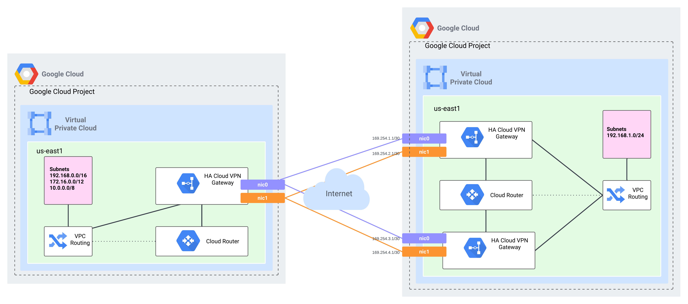
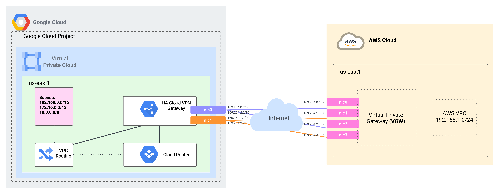

# Overview
This module was created to enable deployment of Cloud VPN resources quickly and at scale within GCP using a Hub and Spoke architecture. With the eventual goal of supporting both Classic and HA VPN within a single module driven through JSON. It is designed to opperate with minimum viable inputs and work in either greenfield or brownfield environments.

- **Q:** Why create this module instead of using the one created/maintained by google? --> https://github.com/terraform-google-modules/terraform-google-vpn
  - **A:** I noticed that other engineers that were either not familiar with terraform or networking were often overwhelmed by the act of deploying a VPN within GCP. I wanted to simplify the expereince and create a module that required only the minimum number of inputs so that anyone cappable of crafting a json file could easily deploy multiple cloud vpns

<br>

> Throughout this document you will see JSON examples referenced in a sequence of keys (or properties) as if you were trying access a specific value within a JSON structure.
> <br>The example below returns `alpha_00_gcp_to_nothing` 
> ```shell
>  jq '.[].hub_router.unique_id' ./examples/project__network/examples/00_gcp_to_nothing.json` 
>```

> Support for Cloud VPN secrets stored in terraform variables or secret manager was introduced in v0.6.5
> - Terraform Variables
>   - Support for passing terraform variables _tfvars for example_ can be passed to this module keys within the `var.variable_pre_shared_secret` variable
>   - Using this example snippet `"terraform_variable_pre_shared_secret": "alpha"` this module would expect the pre-shared secret for the vpn tunnel to be set within `var.variable_pre_shared_secret.alpha`
> - Secret Manger
>   - Support for passing secret manager ids was introduced with this release. 
>   - Using this example snippet `"secret_manager_pre_shared_secret": "bravo"` this module would expect the pre-shared secret for the vpn tunnel to be set within the Hub project_id using a secret name of `bravo`

## JSON Generator
https://r-teller.github.io/terraform-google-cloud-vpn

## JSON Schema Documentation
https://r-teller.github.io/terraform-google-cloud-vpn/documentation/

## Example: GCP to GCP
This example snippet below creates two HA VPN Gateways (One Hub and One Spoke), two Cloud Routers (One Hub and One Spoke) and two tunnels between the specified VPCs in the same project.
- All resources would be dynamically named
- Since no resources were flagged as `pre_existing` all required resources would be created
- Since a *BGP ASN* or *BGP Session Ranges* was not provided they will be automatically generated
  - Random BGP ASNs are in the 32-bit range 4200000000 - 4294967294
  - Based on limitations with Terraform random number generation this module will support approximently 125 randomly generated BGP Session Ranges before creating an overlapping range

```json
[
  {
    "vpn_type": "HA",
    "project_id": "rteller-demo-hst-e265-aaaa",
    "network": "vpc-test-cases-hub-multi-region",
    "region": "US-CENTRAL1",
    "spoke_vpn_gateways": [
      {
        "spoke_vpn_gateway_type": "GCP",
        "spoke_vpn_gateway": {
          "tunnel_count": 2,
          "network": "vpc-test-cases-prod-multi-region"
        }
      }
    ]
  }
]
```

<p align="center">
    
</p>

To work around dynamic naming collisions the following fields can be included within the JSON file, this is useful when deploying multiple enviornments or tunnels at once
- Prefix
- Environment
- Label

If multiple resources need to be deployed from this module that would result an an unintended collision with another resource you may include an additional `unique_id` attribute. This attribute is useful when wanting to deploy more than two tunnels between a hub and spoke. The following resources support `unique_id`
- `.[].hub_router.unique_id`
- `.[].hub_vpn_gateway.unique_id`
- `.[].spoke_vpn_gateways[].spoke_vpn_gateway.unique_id`
- `.[].spoke_vpn_gateways[].spoke_router.unique_id`


### Advanced Example: GCP to GCP (Multiple Spokes)
This example snippet below creates three HA VPN Gateways (One Hub and Two Spoke), two Cloud Routers (One Hub and One Spoke) and four tunnels between the specified VPCs in the same project.
- Since both `spoke_vpn_gateways` resources include a unique value for `.[].spoke_vpn_gateways[].spoke_vpn_gateway.unique_id` each resource will generate a unique HA VPN Gateway within the specified VPC network
- Since neither `spoke_vpn_gateways` resources include a unique value for `.[].spoke_vpn_gateways[].spoke_router.unique_id` both resource will share the same cloud router within the specified VPC network

<p align="center">
    
</p>

```json
[
  {
    "vpn_type": "HA",
    "project_id": "rteller-demo-hst-e265-aaaa",
    "network": "vpc-test-cases-hub-multi-region",
    "region": "US-CENTRAL1",
    "spoke_vpn_gateways": [
      {
        "spoke_vpn_gateway_type": "GCP",
        "spoke_vpn_gateway": {
          "unique_id":"alpha",
          "tunnel_count": 2,
          "network": "vpc-test-cases-prod-multi-region"
        }
      },
      {
        "spoke_vpn_gateway_type": "GCP",
        "spoke_vpn_gateway": {
          "unique_id":"bravo",
          "tunnel_count": 2,
          "network": "vpc-test-cases-prod-multi-region"
        }
      }
    ]
  }
]
```
### Advanced Example: GCP to GCP (Spoke externally managed)
This example snippet below creates one HA VPN Gateways (One Hub), one Cloud Routers (One Hub) and two tunnels from the Hub to Spoke specified VPCs in the same project.
- If you set the `.[].spoke_vpn_gateways[].spoke_vpn_gateway.pre_existing` value to `false` it would create a HA VPN Gateway in the Spoke VPC and two tunnels from the Spoke to Hub specified VPCs in the same project.
- It would expect that a Cloud Router named `spoke-router` already exists in the Spoke VPC
> You could set the `.[].spoke_vpn_gateways[].spoke_router.pre_existing` value to `false` and then it would attempt to create a cloud router in the specified VPC named `spoke-router` but since `.[].spoke_vpn_gateways[].spoke_vpn_gateway.pre_existing` is still set to `true` it would not try and create the two tunnels from the Spoke to Hub specified VPCs in the same project.

```json
[
    {
        "vpn_type": "HA",
        "project_id": "rteller-demo-hst-e265-aaaa",
        "network": "vpc-test-cases-hub-multi-region",
        "region": "US-CENTRAL1",
        "spoke_vpn_gateways": [
            {
                "spoke_vpn_gateway_type": "GCP",
                "spoke_vpn_gateway": {
                    "pre_existing": true,
                    "name": "spoke-vpn-gateway",
                    "tunnel_count": 2,
                    "network": "vpc-test-cases-prod-multi-region"
                },
                "spoke_router": {
                    "name": "spoke-router",
                    "pre_existing": true,
                    "bgp": {
                        "asn": 64512
                    }
                }
            }
        ]
    }
]
```

### GCP to GCP - JSON Schema Generation Example
<details>
  <summary>Display Example SON Schema Generation Image</summary>
<table >
    <tbody>
        <tr >
            <td align="center" valign="top" >                
                            
            </td>
            <td align="center" valign="top">
                            
            </td>
        </tr>
    </tbody>
</table>
</details>

## Example: GCP to AWS / On-Prem
<p align="center">
    
</p>


# Resource Naming
## Terraform Resource Dynamic Name Generation
> Terraform Resource state Id's and names are dynamically generated based on attributes of the resource formatted using x500 name-based uuids.
> - https://developer.hashicorp.com/terraform/language/functions/uuidv5
> - Including the `name` attribute in a resource will explitly name the resource based on that attribute but will still randomly generate a unique terraform state id

<details>
  <summary>Display Resource Name Generation Feilds</summary>

## Cloud Router (google_compute_router)
### Local Side
> Resource Naming == `format("cr-hub-vpn-%s",uuidv5("x500",<...>)`

| Name        | Primary Value                     | Secondary Value           | Default |
| ----------- | --------------------------------- | ------------------------- | :-----: |
| NAME        | (JSON) `.[].hub_router.name`      | N/A                       | `null`  |
| PREFIX      | (JSON) `.[].prefix`               | N/A                       | `null`  |
| ENVIRONMENT | (JSON) `.[].environment`          | N/A                       | `null`  |
| LABEL       | (JSON) `.[].label`                | N/A                       | `null`  |
| UNIQUE_ID   | (JSON) `.[].hub_router.unique_id` | N/A                       | `null`  |
| PROJECT_ID  | (JSON) `.[].project_id`           | (TF VAR) `var.project_id` |   N/A   |
| NETWORK     | (JSON) `.[].network`              | (TF VAR) `var.network`    |   N/A   |
| REGION      | (JSON) `.[].region`               | (TF VAR) `var.region`     |   N/A   |
| BGP_ASN     | (JSON) `.[].hub_router.bgp.asn`   | N/A                       | `null`  |

### Remote Side (If Managed by this module)
> Resource Naming == `format("cr-spoke-vpn-%s",uuidv5("x500",<...>)`

| Name        | Primary Value                     | Secondary Value           | Default |
| ----------- | --------------------------------- | ------------------------- | :-----: |
| NAME        | (JSON) `.[].hub_router.name`      | N/A                       | `null`  |
| PREFIX      | (JSON) `.[].prefix`               | N/A                       | `null`  |
| ENVIRONMENT | (JSON) `.[].environment`          | N/A                       | `null`  |
| LABEL       | (JSON) `.[].label`                | N/A                       | `null`  |
| UNIQUE_ID   | (JSON) `.[].hub_router.unique_id` | N/A                       | `null`  |
| PROJECT_ID  | (JSON) `.[].project_id`           | (TF VAR) `var.project_id` |   N/A   |
| NETWORK     | (JSON) `.[].network`              | (TF VAR) `var.network`    |   N/A   |
| REGION      | (JSON) `.[].region`               | (TF VAR) `var.region`     |   N/A   |
| BGP_ASN     | (JSON) `.[].hub_router.bgp.asn`   | N/A                       | `null`  |

## HA VPN Gateway (google_compute_ha_vpn_gateway)
### Local Side
> Resource Naming == `format("ha-hub-vpn-%s",uuidv5("x500",<...>)`

| Name        | Primary Value                           | Secondary Value           | Default |
| ----------- | --------------------------------------- | ------------------------- | :-----: |
| NAME        | (JSON) `.[].hub_vpn_gateway.name`       | N/A                       | `null`  |
| PREFIX      | (JSON) `.[].prefix`                     | N/A                       | `null`  |
| ENVIRONMENT | (JSON) `.[].environment`                | N/A                       | `null`  |
| LABEL       | (JSON) `.[].label`                      | N/A                       | `null`  |
| UNIQUE_ID   | (JSON) `.[].hub_vpn_gateway.unique_id`  | N/A                       | `null`  |
| PROJECT_ID  | (JSON) `.[].project_id`                 | (TF VAR) `var.project_id` |   N/A   |
| NETWORK     | (JSON) `.[].network`                    | (TF VAR) `var.network`    |   N/A   |
| REGION      | (JSON) `.[].region`                     | (TF VAR) `var.region`     |   N/A   |
| VPN_TYPE    | (JSON) `.[].vpn_type`                   | N/A                       |   N/A   |
| STACK_TYPE  | (JSON) `.[].hub_vpn_gateway.stack_type` | N/A                       |   N/A   |

### Remote Side (If Managed by this module)
> Resource Naming == `format("ha-spoke-vpn-%s",uuidv5("x500",<...>)`

| Name        | Primary Value                                                  | Secondary Value         | Tertiary Value            | Default |
| ----------- | -------------------------------------------------------------- | ----------------------- | ------------------------- | :-----: |
| NAME        | (JSON) `.[].spoke_vpn_gateways[].spoke_vpn_gateway.name`       | N/A                     | N/A                       | `null`  |
| PREFIX      | (JSON) `.[].prefix`                                            | N/A                     | N/A                       | `null`  |
| ENVIRONMENT | (JSON) `.[].environment`                                       | N/A                     | N/A                       | `null`  |
| LABEL       | (JSON) `.[].label`                                             | N/A                     | N/A                       | `null`  |
| UNIQUE_ID   | (JSON) `.[].spoke_vpn_gateways[].spoke_vpn_gateway.unique_id`  | N/A                     | N/A                       | `null`  |
| PROJECT_ID  | (JSON) `.[].spoke_vpn_gateways[].spoke_vpn_gateway.project_id` | (JSON) `.[].project_id` | (TF VAR) `var.project_id` |   N/A   |
| NETWORK     | (JSON) `.[].network`                                           | N/A                     | N/A                       |   N/A   |
| REGION      | (JSON) `.[].spoke_vpn_gateways[].spoke_vpn_gateway.region`     | (JSON) `.[].region`     | (TF VAR) `var.region`     |   N/A   |

## External VPN Gateway (google_compute_external_vpn_gateway)
> Resource Naming == `format("ha-peer-vpn-%s",uuidv5("x500",<...>)`

| Name            | Primary Value                                                      | Secondary Value           |     Default      |
| --------------- | ------------------------------------------------------------------ | ------------------------- | :--------------: |
| NAME            | (JSON) `.[].spoke_vpn_gateways[].spoke_vpn_gateway.name`           | N/A                       |      `null`      |
| PREFIX          | (JSON) `.[].prefix`                                                | N/A                       |      `null`      |
| ENVIRONMENT     | (JSON) `.[].environment`                                           | N/A                       |      `null`      |
| LABEL           | (JSON) `.[].label`                                                 | N/A                       |      `null`      |
| UNIQUE_ID       | (JSON) `.[].spoke_vpn_gateways[].spoke_vpn_gateway.unique_id`      | N/A                       |      `null`      |
| PROJECT_ID      | (JSON) `.[].project_id`                                            | (TF VAR) `var.project_id` |       N/A        |
| REDUNDANCY_TYPE | (JSON) `.[].spoke_vpn_gateways[].spoke_vpn_gateway.redudancy_type` | N/A                       | `TWO_INTERFACES` |

## VPN Tunnel | Router Interface | BGP Peer (google_compute_vpn_tunnel |google_compute_router_interface | google_compute_router_peer)
### Local Side
> Resource Naming == `format("vpn-%s-tunnel-%s",<...TUNNEL_TYPE...>,uuidv5("x500",<...>)`
> Tunnel Types
> - External == `hub-ext`
> - GCP == `hub-spoke`

| Name                         | Primary Value                                                  | Secondary Value           | Default |
| ---------------------------- | -------------------------------------------------------------- | ------------------------- | :-----: |
| NAME                         | `null`                                                         | N/A                       | `null`  |
| PREFIX                       | (JSON) `.[].prefix`                                            | N/A                       | `null`  |
| ENVIRONMENT                  | (JSON) `.[].environment`                                       | N/A                       | `null`  |
| LABEL                        | (JSON) `.[].label`                                             | N/A                       | `null`  |
| UNIQUE_ID                    | (JSON) `.[].hub_router.unique_id`                              | N/A                       | `null`  |
| PROJECT_ID                   | (JSON) `.[].project_id`                                        | (TF VAR) `var.project_id` |   N/A   |
| NETWORK                      | (JSON) `.[].network`                                           | (TF VAR) `var.network`    |   N/A   |
| REGION                       | (JSON) `.[].region`                                            | (TF VAR) `var.region`     |   N/A   |
| ROUTER_NAME                  | (JSON) `.[].hub_router.name`                                   | N/A                       | `null`  |
| HUB_VPN_GATEWAY_NAME         | (JSON) `.[].hub_vpn_gateway.name`                              | N/A                       | `null`  |
| HUB_VPN_GATEWAY_UNIQUE_ID    | (JSON) `.[].hub_vpn_gateway.unique_id`                         | N/A                       | `null`  |
| TUNNEL_INDEX                 | (TF VALUE DERIVED BASED ON Tunnel #)                           | N/A                       |   N/A   |
| SPOKE_VPN_GATEWAY_UUIDV5     | (TF VALUE DERIVED ABOVE)                                       | N/A                       |   N/A   |
| SPOKE_VPN_GATEWAY_TYPE       | (JSON) `.[].spoke_vpn_gateways[].spoke_vpn_gateway_type`       | N/A                       |   N/A   |
| SPOKE_VPN_GATEWAY_PROJECT_ID | (JSON) `.[].spoke_vpn_gateways[].spoke_vpn_gateway.project_id` | `.[].project_id`          |   N/A   |
| SPOKE_VPN_GATEWAY_NETWORK    | (JSON) `.[].spoke_vpn_gateways[].spoke_vpn_gateway.network`    | N/A                       |   N/A   |
| SPOKE_VPN_GATEWAY_NAME       | (JSON) `.[].spoke_vpn_gateways[].spoke_vpn_gateway.name`       | N/A                       | `null`  |
| SPOKE_VPN_GATEWAY_UNIQUE_ID  | (JSON) `.[].spoke_vpn_gateways[].spoke_vpn_gateway.unique_id`  | N/A                       | `null`  |

### Remote Side (If Managed by this module)
> Resource Naming == `format("vpn-r-l-tunnel-%s",uuidv5("x500",<...>)`

| Name                         | Primary Value                                                 | Secondary Value           | Default |
| ---------------------------- | ------------------------------------------------------------- | ------------------------- | :-----: |
| NAME                         | `null`                                                        | N/A                       | `null`  |
| PREFIX                       | (JSON) `.[].prefix`                                           | N/A                       | `null`  |
| ENVIRONMENT                  | (JSON) `.[].environment`                                      | N/A                       | `null`  |
| LABEL                        | (JSON) `.[].label`                                            | N/A                       | `null`  |
| UNIQUE_ID                    | (JSON) `.[].hub_router.unique_id`                             | N/A                       | `null`  |
| PROJECT_ID                   | (JSON) `.[].project_id`                                       | (TF VAR) `var.project_id` |   N/A   |
| NETWORK                      | (JSON) `.[].network`                                          | (TF VAR) `var.network`    |   N/A   |
| REGION                       | (JSON) `.[].region`                                           | (TF VAR) `var.region`     |   N/A   |
| ROUTER_NAME                  | (JSON) `.[].spoke_vpn_gateways[].spoke_router.name`           | N/A                       | `null`  |
| HUB_VPN_GATEWAY_NAME         | (JSON) `.[].spoke_vpn_gateways[].spoke_vpn_gateway.name`      | N/A                       | `null`  |
| HUB_VPN_GATEWAY_UNIQUE_ID    | (JSON) `.[].spoke_vpn_gateways[].spoke_vpn_gateway.unique_id` | N/A                       | `null`  |
| TUNNEL_INDEX                 | (TF VALUE DERIVED BASED ON Tunnel #)                          | N/A                       |   N/A   |
| SPOKE_VPN_GATEWAY_UUIDV5     | (TF VALUE DERIVED ABOVE)                                      | N/A                       |   N/A   |
| SPOKE_VPN_GATEWAY_TYPE       | (JSON) `.[].spoke_vpn_gateways[].spoke_vpn_gateway_type`      | N/A                       |   N/A   |
| SPOKE_VPN_GATEWAY_PROJECT_ID | (JSON) `.[].hub_vpn_gateway.project_id`                       | `.[].project_id`          |   N/A   |
| SPOKE_VPN_GATEWAY_NETWORK    | (JSON) `.[].hub_vpn_gateway.network`                          | N/A                       |   N/A   |
| SPOKE_VPN_GATEWAY_NAME       | (JSON) `.[].hub_vpn_gateway.name`                             | N/A                       | `null`  |
| SPOKE_VPN_GATEWAY_UNIQUE_ID  | (JSON) `.[].hub_vpn_gateway.unique_id`                        | N/A                       | `null`  |
  
</details>

# Troubleshooting Error Messages

## Duplicate Hub or Spoke Cloud Routers
You may see the following error snippet when attempting to deploy multiple cloud routers with unique route advertisement configurations but based on `prefix`, `environment`,`label`,`project_id`,`network` or `name` result in the same uuid being generated. If the goal is to have multiple unique configurations make sure to include a `unique_id` attribute to differentiate them
### Error Message
```shell
│ Error: Duplicate object key
│
│   on ..\..\main.tf line 281, in locals:
│  281:   map_spoke_routers = { for spoke_routers in local._spoke_routers : spoke_routers.uuidv5 => spoke_routers if spoke_routers.uuidv5 != null }
│     ├────────────────
│     │ spoke_routers.uuidv5 is "cr-spoke-vpn-869f6a79-1fa2-52ea-b461-727bf62e0e18"
│
│ Two different items produced the key "cr-spoke-vpn-869f6a79-1fa2-52ea-b461-727bf62e0e18" in this 'for' expression. If duplicates are expected, use the ellipsis (...) after the value expression to enable grouping by key.
```
### Bad JSON Snippet
```json
[
    {
        ...
        "hub_router": {
            "bgp": {
                "hub_subnet_advertisements": "DEFAULT"
            }
        }
    },
    {
        ...
        "hub_router": {
            "bgp": {
                "hub_subnet_advertisements": "CUSTOM",
                "custom_hub_subnet_advertisements": [
                    "192.168.0.0/16",
                    "172.16.0.0/12",
                    "10.0.0.0/8"
                ]
            }
        }
    }
]

```
### Good JSON Snippet
```json
[
    {
        ...
        "hub_router": {
            "unique_id":"alpha",
            "bgp": {
                "hub_subnet_advertisements": "DEFAULT"
            }
        }
    },
    {
        ...
        "hub_router": {
            "unique_id":"bravo",
            "bgp": {
                "hub_subnet_advertisements": "CUSTOM",
                "custom_hub_subnet_advertisements": [
                    "192.168.0.0/16",
                    "172.16.0.0/12",
                    "10.0.0.0/8"
                ]
            }
        }
    }
]

```

## Duplicate Spoke VPN Gateways (Dynamic Static Addresses)
You may see the following error snippet when attempting to peer with the same spoke VPN Gateway multiple times. If that is the goal make sure to include a `unique_id` attribute to differentiate the first and second spoke vpn deployments
### Error Message
```shell
│ Error: Error creating VpnTunnel: googleapi: Error 400: Invalid value for field 'resource.peerGcpGateway': 'projects/<..project_id..>/regions/us-central1/vpnGateways/ha-hub-vpn-16125d9f-4535-5331-99d4-758f8bceb516'. A tunnel with same peer GCP VPN gateway is already associated with the same local VPN gateway interface., invalid
│
│   with module.cloud_vpn.google_compute_vpn_tunnel.spoke_vpn_tunnels["vpn-spoke-hub-tunnel-be8b929a-18b0-5f45-8023-5765e2fac059"],
│   on ..\..\main.tf line 815, in resource "google_compute_vpn_tunnel" "spoke_vpn_tunnels":
│  815: resource "google_compute_vpn_tunnel" "spoke_vpn_tunnels" {
```
### Bad JSON Snippet
```json
[
    {
        ...,
        "spoke_vpn_gateways":[
            {
                "spoke_vpn_gateway": {
                    "tunnel_count": 1
                },
                "spoke_router":{
                    "advanced_tunnel_configuration": [
                        {                                
                            "hub_ipv4_address": "169.254.0.1",
                            "spoke_ipv4_address": "169.254.0.2"
                        }
                    ]
                }
            },
            {                
                "spoke_vpn_gateway": {
                    "tunnel_count": 1
                },
                "spoke_router":{
                    "advanced_tunnel_configuration": [
                        {                                
                            "hub_ipv4_address": "169.254.0.5",
                            "spoke_ipv4_address": "169.254.0.7"
                        }
                    ]
                }
            }
        ]
    }
]
```
### Good JSON Snippet
```json
[
    {
        ...,
        "spoke_vpn_gateways":[
            {
                "spoke_vpn_gateway": {
                    "unique_id":"alpha",
                    "tunnel_count": 1
                },
                "spoke_router":{
                    "advanced_tunnel_configuration": [
                        {                                
                            "hub_ipv4_address": "169.254.0.1",
                            "spoke_ipv4_address": "169.254.0.2"
                        }
                    ]
                }
            },
            {                
                "spoke_vpn_gateway": {
                    "unique_id":"bravo",
                    "tunnel_count": 1
                },
                "spoke_router":{
                    "advanced_tunnel_configuration": [
                        {                                
                            "hub_ipv4_address": "169.254.0.5",
                            "spoke_ipv4_address": "169.254.0.7"
                        }
                    ]
                }
            }
        ]
    }
]
```

## Duplicate Hub to Spoke VPN Tunnels (Dynamic Tunnel Addresses)
You may see the following error snippet when attempting to peer with the same hub and spoke VPN Gateway multiple times. If that is the goal make sure to include a `unique_id` attribute to differentiate the first and second spoke vpn deployments
### Error Message
```shell
│     │ v1.environment is null
│     │ v1.hub_vpn_gateway.hub_router.name is "cr-hub-vpn-f69433e4-3345-5b63-8115-5877311f33e4"
│     │ v1.hub_vpn_gateway.name is "ha-hub-vpn-05d6e144-1f13-596c-b864-f423df11d146"
│     │ v1.hub_vpn_gateway.network is "vpc-test-cases-hub-multi-region"
│     │ v1.hub_vpn_gateway.project_id is "rteller-demo-hst-e265-aaaa"
│     │ v1.hub_vpn_gateway.unique_id is "03_gcp_to_gcp_multi_spoke"
│     │ v1.hub_vpn_gateway.uuidv5 is "ha-hub-vpn-05d6e144-1f13-596c-b864-f423df11d146"
│     │ v1.label is "alpha"
│     │ v1.prefix is null
│     │ v1.spoke_vpn_gateway.name is "ha-spoke-vpn-c89bff03-f1b4-5d99-8e23-3d20f267f89d"
│     │ v1.spoke_vpn_gateway.network is "vpc-test-cases-prod-multi-region"
│     │ v1.spoke_vpn_gateway.project_id is "rteller-demo-hst-e265-aaaa"
│     │ v1.spoke_vpn_gateway.spoke_router.name is "cr-spoke-vpn-35774440-8a1e-5b4e-9bb7-e5d033ce11f8"
│     │ v1.spoke_vpn_gateway.type is "gcp"
│     │ v1.spoke_vpn_gateway.unique_id is "03_gcp_to_gcp_multi_spoke_alpha"
│     │ v1.spoke_vpn_gateway.uuidv5 is "ha-spoke-vpn-c89bff03-f1b4-5d99-8e23-3d20f267f89d"
│     │ v1.tunnel_index is 0
│
│ Two different items produced the key "vpn-hub-spoke-tunnel-1046e6e9-2698-51c4-91f3-b4b3ea4df374" in this 'for' expression. If duplicates are expected, use the ellipsis (...) after the value expression to enable grouping by key.
```
### Bad JSON Snippet
```json
[
    {
        ...,
        "spoke_vpn_gateways":[
            {
                "spoke_vpn_gateway": {
                    "tunnel_count": 2
                }
            },
            {                
                "spoke_vpn_gateway": {
                    "tunnel_count": 2
                }
            }
        ]
    }
]
```
### Good JSON Snippet
```json
[
    {
        ...,
        "spoke_vpn_gateways":[
            {
                "spoke_vpn_gateway": {
                    "unique_id":"alpha",
                    "tunnel_count": 2
                }
            },
            {                
                "spoke_vpn_gateway": {
                    "unique_id":"bravo",
                    "tunnel_count": 2
                }
            }
        ]
    }
]
```

## VPN Gateway was not found
You may see the following error snippet when attempting to peer with the a spoke VPN Gateway that has not yet been created. If that is the goal is to proactively create the hub vpn gateway first so that a remote spoke vpn gateway managed externally to this terraform module may target it you can set the `tunnel_count` value to 0.
### Error Message
```shell
│ Error: Error creating VpnTunnel: googleapi: Error 404: The resource 'projects/rteller-demo-hst-e265-aaaa/regions/us-central1/vpnGateways/spoke-vpn-gateway' was not found, notFound
│
│   with module.cloud_vpn.google_compute_vpn_tunnel.hub_vpn_tunnels["vpn-hub-spoke-tunnel-56159bf4-2390-5044-8c49-1f1c35b58d5d"],
│   on .terraform\modules\cloud_vpn\main.tf line 820, in resource "google_compute_vpn_tunnel" "hub_vpn_tunnels":
│  820: resource "google_compute_vpn_tunnel" "hub_vpn_tunnels" {
```
### Example JSON Snippet
```json
[
    {
        ...,
        "spoke_vpn_gateways":[
            {
                "spoke_vpn_gateway_type": "GCP",
                "spoke_vpn_gateway": {
                    "pre_existing": true,
                    "name": "spoke-vpn-gateway",
                    "tunnel_count": 0
                },
                "spoke_router":{
                    "pre_existing": true,
                    "name": "spoke-router"
                }
            }
        ]
    }
]
```
## Dupliacte BGP Session Range
You may see the following error snippet when creating a bgp peer session range that overlaps with an existing range already deployed. If you see this error you may work around the duplicate session range by statically assigning a value in the `169.254.0.0/16 range`

### Error Message
```shell
│ Error: Error patching router us-central1/cr-hub-vpn-7bd59d5e-bb8f-59d7-b612-4687a41cd47a: googleapi: Error 400: Invalid value for field 'resource.interfaces[0].ipRange': '169.254.11.2/30'. IP Range 169.254.11.0/30 of router cr-hub-vpn-7bd59d5e-bb8f-59d7-b612-4687a41cd47a interface vpn-hub-peer-tunnel-c7493d2f-1f93-58b0-962c-46f0037e1657 conflicts with router cr-hub-vpn-e3a1ef19-bd3f-534f-8797-804179b5c86e interface vpn-hub-peer-tunnel-145c00e5-c831-555c-beb1-f45666eaf782., invalid
│
│   with module.cloud_vpn.google_compute_router_interface.hub_router_interfaces["vpn-hub-peer-tunnel-c7493d2f-1f93-58b0-962c-46f0037e1657"],
│   on ..\..\main.tf line 955, in resource "google_compute_router_interface" "hub_router_interfaces":
│  955: resource "google_compute_router_interface" "hub_router_interfaces" {
```

# Roadmap Module Features
- UI
  - JSON Generation
    - Improve the UI for JSON generation
    - Introduce support for `Advanced Options` toggle that hides fields not required from a minimum viable configuration perspective
    - Update Spoke Router and VPN Gateway UI to better explain how the combination of `pre_existing` flags is used to determine wheather or not to create tunnels
  - JSON Import
    - Introduce support for importing pre-created JSON so that it can be manipulated within the UI
- Output Template
    - Introduce output configuration templates so that when Cloud VPN is integrated with 3rd party VPNs configuration is simplier
- Shared Secrets
  - ~~Introduce support this module to retrieve a pre_shared_secret from Secrets Manager instead of storing it in JSON~~ Introduced in v0.6.5
- HA Cloud VPN
  - Expand automatic creation of BGP ASN to support both 16-bit and 32-bit ranges, currently only 32-bit BGP ASN are supported for automatic creation
  - Determine if hub/spoke tunnels need to support explicit naming
  - Determine if unique naming is needed for `google_compute_router_interface` & `google_compute_router_peer` resources, currently they use the same name as `google_compute_vpn_tunnel`
- Classic Cloud VPN
  - Support for this will be introduced in the near future
    - This may end up being a different module, will know more after i go down the rabbit hole

# Useful Tools
## JSON Schema Validator
This tool provides a way of validating that the cloud_vpn json input matches the acceptable JSON Schema used to design and structure the terraform business logic for this module
- https://github.com/ajv-validator/ajv
- https://ajv.js.org/packages/ajv-cli.html
```bash
npm install -g ajv-cli

ajv validate -s "./schemas/resolved/resolved.schema.json" -d "./examples/project__network/examples/*.json" --strict=false
ajv validate -s "../schemas/resolved/resolved.schema.json" -d "../examples/project__network/examples/*.json" --strict=false
```

## JSON Schema Dereferencer
This tool is used to dereference multiple json schemas into a single file
- https://github.com/davidkelley/json-dereference-cli
```bash
npm install -g json-dereference-cli
json-dereference -s my-schema.json -o compiled-schema.yaml
```

## React Widget from JSON Schema Generator
This tool is used to dynamically build a react based web-ui from JSON Schema
- https://github.com/ui-schema/ui-schema

## JSON Schema to Documentation
This tool is used to dynamically builds documentation from the JSON Schema to define acceptable inputs and permutations
- https://github.com/coveooss/json-schema-for-humans
```bash
## Install as admin to make globally available
pip install json-schema-for-humans
```

## GCP HA VPN Examples
These are example reference architectures for deploy HA Cloud VPNS between multiple environments
- GCP to GCP
  - https://cloud.google.com/network-connectivity/docs/vpn/how-to/creating-ha-vpn2
- GCP to Azure
  - https://cloud.google.com/network-connectivity/docs/vpn/tutorials/create-ha-vpn-connections-google-cloud-azure
- GCP to AWS 
  - https://cloud.google.com/network-connectivity/docs/vpn/tutorials/create-ha-vpn-connections-google-cloud-aws
